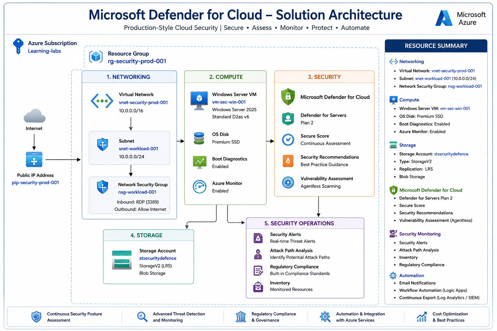

# 🛡️ Microsoft Defender for Cloud Security Lab


---

# 📌 Project Overview

This project demonstrates the implementation of **Microsoft Defender for Cloud** in a production-style Azure environment using a Pay-As-You-Go subscription.

The implementation focuses on improving cloud security posture by enabling workload protection, reviewing security recommendations, analyzing resource health, evaluating regulatory compliance, and exploring Microsoft Defender for Cloud capabilities available without premium licensing.

---

# 🏗️ Solution Architecture

The following diagram represents the Microsoft Defender for Cloud implementation performed during this project.

<p align="center">
  
</p>

---

# 🎯 Project Objectives

- Deploy a secure Azure environment
- Enable Microsoft Defender for Cloud
- Configure Defender for Servers Plan
- Review Secure Score
- Analyze Security Recommendations
- Explore Resource Inventory
- Review Resource Health
- Analyze Attack Paths
- Review Regulatory Compliance
- Explore Security Policies
- Review Security Alerts
- Configure Email Notifications
- Review Workflow Automation
- Review Continuous Export
- Clean up all deployed resources

---

# 🏛️ Azure Environment

| Component | Configuration |
|-----------|--------------|
| Cloud | Microsoft Azure |
| Subscription | Learning-labs |
| Region | Central India |
| VM | Windows Server 2025 |
| Virtual Network | vnet-security-prod-001 |
| Subnet | snet-workload-001 |
| Network Security Group | nsg-workload-001 |
| Storage Account | stsecuritydefence |
| Microsoft Defender for Cloud | Enabled |
| Defender for Servers | Plan 2 |
| Subscription Type | Pay-As-You-Go |

---

# 🛠️ Technologies Used

- Microsoft Azure
- Microsoft Defender for Cloud
- Microsoft Defender for Servers
- Azure Virtual Machine
- Azure Virtual Network
- Azure Storage Account
- Network Security Groups
- Microsoft Cloud Security Benchmark
- Azure Resource Manager
- Azure Monitor

---

# 📂 Project Structure

```
azure-defender-for-cloud-security
│
├── Architecture
├── Cleanup
├── Documentation
├── Implementation
├── Interview-Preparation
├── Screenshots
└── README.md
```

---

# 🚀 Implementation Summary

### Phase 1 – Azure Environment

- Resource Group
- Virtual Network
- Subnet
- Windows Virtual Machine
- Storage Account
- Network Security Group

---

### Phase 2 – Microsoft Defender for Cloud

- Enabled Defender for Cloud
- Enabled Defender for Servers
- Reviewed Defender Plans
- Reviewed Settings & Monitoring

---

### Phase 3 – Security Posture

- Secure Score
- Security Recommendations
- Security Inventory
- Resource Health

---

### Phase 4 – Security Operations

- Security Alerts
- Attack Path Analysis
- Regulatory Compliance
- Workload Protections

---

### Phase 5 – Environment Configuration

- Security Policies
- Email Notifications
- Workflow Automation
- Continuous Export

---

### Phase 6 – Cleanup

- Disabled Defender Plans
- Deleted Resource Group
- Removed Azure Resources
- Cost Optimization Completed

---

# 📸 Screenshots

The project contains screenshots for:

- Azure Resources
- Virtual Machine
- Virtual Network
- Storage Account
- Network Security Group
- Defender Plans
- Security Posture
- Secure Score
- Recommendations
- Resource Health
- Inventory
- Workload Protection
- Regulatory Compliance
- Attack Path Analysis
- Security Alerts
- Email Notifications
- Workflow Automation
- Continuous Export
- Cleanup

---

# 🔒 Security Features Demonstrated

- Cloud Security Posture Management (CSPM)
- Defender for Servers
- Secure Score
- Security Recommendations
- Resource Inventory
- Resource Health
- Attack Path Analysis
- Regulatory Compliance
- Security Policies
- Email Notifications
- Workflow Automation
- Continuous Export

---

# 📚 Key Learnings

- Microsoft Defender for Cloud architecture
- Defender Plans
- Cloud Security Posture Management
- Secure Score improvement
- Security Recommendations
- Azure Resource Health
- Resource Inventory
- Regulatory Compliance
- Security Policies
- Attack Path Analysis
- Defender Workload Protection
- Cost Optimization

---

# 🎤 Interview Topics Covered

- Microsoft Defender for Cloud
- Microsoft Defender for Servers
- CSPM
- Secure Score
- Security Recommendations
- Regulatory Compliance
- Attack Path Analysis
- Azure Resource Health
- Defender Plans
- Continuous Export
- Workflow Automation
- Security Policies

---

# 💰 Cost Optimization

This project was performed using an Azure Pay-As-You-Go subscription.

After completing the lab:

- Defender plans were disabled.
- Resource group was deleted.
- Resources were removed to avoid recurring charges.

---

# ⚠️ Limitations

The following enterprise features require additional Microsoft Defender licensing or production workloads and were **not implemented** in this lab:

- Microsoft Defender CSPM
- Defender for Storage
- Defender for SQL
- Defender for Containers
- Defender for App Service
- DevOps Security
- File Integrity Monitoring
- Just-In-Time VM Access
- Adaptive Application Controls

These features were explored from the Azure portal but not configured.

---

# 👨‍💻 Author

**Suman Duddi**

Azure Administrator | Azure Security | Microsoft Defender for Cloud | Microsoft Entra ID | Azure Governance

---

⭐ If you found this project helpful, feel free to star this repository.
